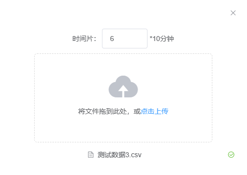
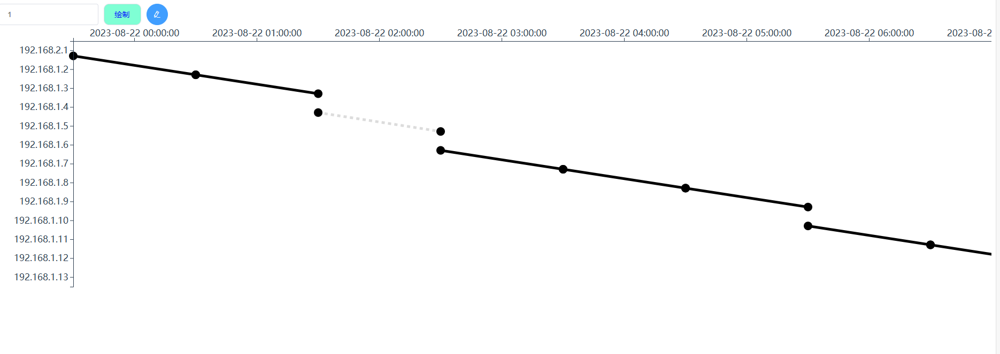
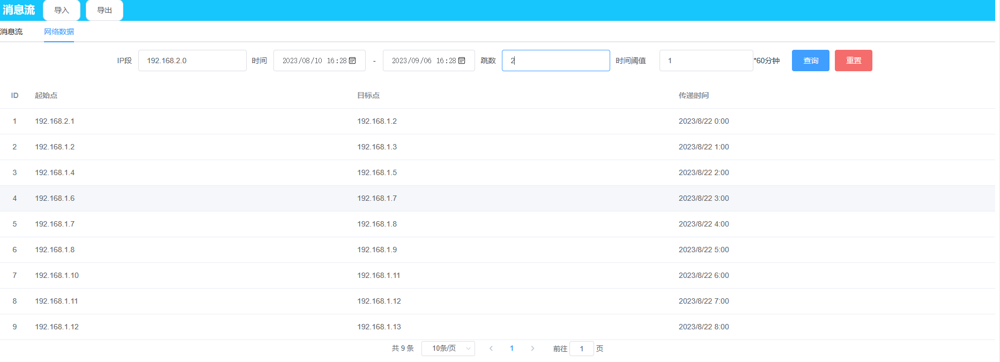

# 消息流组件提取

## 1、导入

（当前导入按照原本测试模式的文件导入来做，具体逻辑看前端代码注释）



点击导入，在文件框中点击或者拖入数据（csv格式），有且只能存在一个文件，想要换数据点击文件旁边大叉，测试数据在public文件夹里面，时间片为6。

手动输入时间片，单位为10分钟

## 2、绘制消息流

输入纵轴精确度（默认为1），点击绘制

## 3、消息流交互



默认会标黑选取线段，这个是时间阈值默认为1。

可进行选择和取消选择线段，放大缩小

坐标轴精确度：如果只想要修改坐标轴精确度，修改精确度值，点击蓝色edit按钮，不会重新绘制，点击绘制按钮的话就会重新绘制，浪费时间

## 4、网络数据表格



ip段格式：192.168.1.0;192.168.2.0 (以0结尾，以;分割)

时间筛选器

跳数

时间阈值默认为1

若没输入则会提示输入

点击查询，下方表格会出现信息，同时消息流图被清空，然后重新点击绘制，绘制检索结果数据图，ip符合的标红

点击重置，重置表单内容，表格数据变为所有数据，同时消息流清空

## 5、导出

导出数据不知道怎么使用，所以直接log出来

## 6、备注

若不需要导入功能则可以注释掉，使用已有json数据。

注意：1、需要对数据进行处理，代码uploadFileTest中有

```js
//数据进行时间处理，增添数据属性，把2023-8-22 00:00:00 转换成毫秒，方便后续画图比较
for (let i = 0; i < this.tabledata.length; i++) {
    this.tabledata[i].timesecond = Date.parse(this.tabledata[i].time)
            }
```

2、如果检索不能使用，那么检索参数就是两个一个是原始数据，一个是交互的表单数据

3、一共用到三个后台接口，保存数据、读取数据和检索数据


# app

## Project setup
```
npm install
```

### Compiles and hot-reloads for development
```
npm run serve
```

### Compiles and minifies for production
```
npm run build
```

### Lints and fixes files
```
npm run lint
```

### Customize configuration
See [Configuration Reference](https://cli.vuejs.org/config/).
